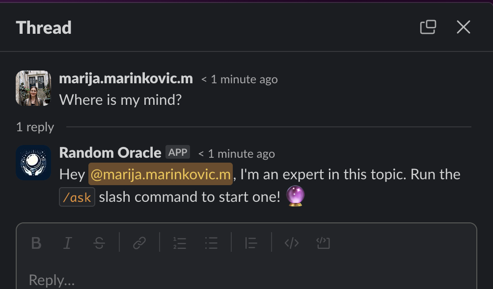

# random-bot-app

<p align="center">
  
</p>

The experment bot for generating hexagrams on slash commands.
It allows users to ask any question and receive a hexagram and a poetic text as a response. The app uses a slash command, which is a way to invoke an app by typing a string into the message box. The app's slash command is `/ask`, followed by the user's question (or nothing for general read).

The app tries to replicate the Yarrow Stalk casting method, which is one of the traditional ways to generate a hexagram from the I Ching.
User can either scratch the poetry recieved from the bot, or save it to Notion database and publish to main channel for further discussion.

The app's purpose is to provide a fun and creative way to explore the ancient wisdom. The app is inspired by a book called "The Science of I Ching" by Joseph K. Kim & Dr. David S. Lee, which focuses on the beginnings of Eastern thought. The app also thanks [pantherwebworks](http://pantherwebworks.com/I%5FChing/bk1h1-10.html#1) for providing the web source for the poetic texts.

The project uses several AWS resources, including Lambda functions and an API Gateway API. These resources are defined in the `template.yaml` file. You can update the template to add AWS resources through the same deployment process that updates your application code.

## Requirements

- Slack workspace with admin access
- Notion account with API access
- AWS account; AWS CLI

```bash
sam build
sam deploy --guided
```

1. Create custom bot for slack
2. Configure slash command to accept requests and save them to Notion
3. Nudge shortcut
4. Connect Slack App to Notion (https://www.notion.so/my-integrations)
5. Install Slack App to your workspace (https://api.slack.com/apps/)
6. Configure bot permissions, interactivity, slash commands with the request URL (using API Gateway endpoint URL for RandomBot function)
7. Populate environment variables in the console.aws.amazon.com (names sampled in `template.yaml`)

## Use the SAM CLI to build and test locally

Build your application with the `sam build` command.

```bash
random-bot-app$ sam build
```

Run functions locally and invoke them with the `sam local invoke` command.

```bash
random-bot-app$ sam local invoke RandomBotFunction --event events/event.json
```

The SAM CLI can also emulate your application's API. Use the `sam local start-api` to run the API locally on port 3000.

```bash
random-bot-app$ sam local start-api
random-bot-app$ curl http://localhost:3000/
```

## Logs

```bash
random-bot-app$ sam logs -n RandomBotFunction --stack-name random-bot-app --tail
```

## Unit tests

```bash
random-bot-app$ cd src
src$ npm install
src$ npm run test
```

### Nudge Preview



_App logo generated with [DALL·E 3](https://openai.com/dall-e-3) 🙇_

## Cleanup

To delete the application can use the AWS CLI:

```bash
sam delete --stack-name random-bot-app
```


